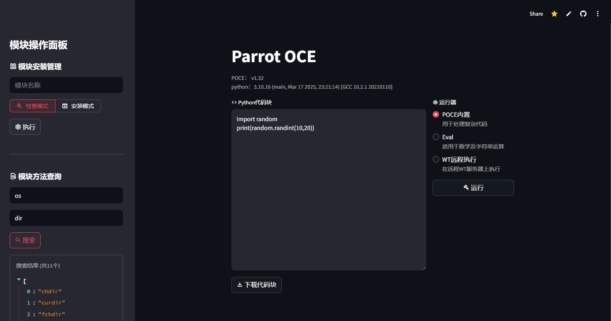
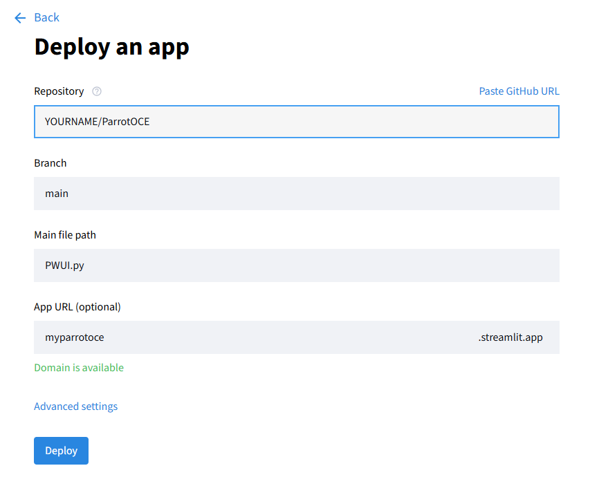

# ParrotOCE
Parrot Online Code Environment
鹦鹉在线编程环境  用于python编写与测试  
~~更适合中国程序员体质的在线编辑器~~

>This project is not supported for other languages, if you can not read Chinese, please use another program

注意！
```
该程序处于测试阶段
部分功能可能无法完美运行，且可能有漏洞存在，因此您不能将其部署到生产环境！
```

## 功能概览
### 屏幕截图：

### 功能说明
|功能|注释|缺点|
| ---------- | -----------| -----------|
|报错/输出翻译|支持输出一键翻译为中文|目前没能在Streamlit社区云（github部署）上成功运行|
|防恶意攻击|通过关键词检测来避免恶意方法攻击，如：os.dir()|可能误判，对代码产生局限性|
|模块在线安装|允许用户在使用时安装来自pypi的模块|不支持虚拟环境|
|代码与输出内容下载|无需手动创建文件，点击即下载|无|
|模块方法查询|列出模块所有可用方法，允许针对关键词搜索方法|无|
### 平台对比
|~|本地部署|Streamlit社区云（github部署）|
| ---------- | -----------| -----------|
|报错/输出翻译|✅完全支持|⚠️不支持|
|模块在线安装|✅完全支持|⚠️不支持|
|代码与输出内容下载|✅完全支持|✅完全支持|
|模块方法查询|✅完全支持|✅完全支持|

## 部署
有2种部署途径：  
[本地部署](#本地部署)  
[Streamlit社区云部署](#Streamlit社区云部署)  


在进行任何一个部署途径前（除了Streamlit社区云部署）  
您都应该先运行以下命令来确保ParrotOCE能够正常运行：
```bash
pip install streamlit importlib translators
```
注意！streamlit版本最低为`1.44.0`才能满足ParrotOCE正常运行


### 本地部署
首先clone本仓库：  
```bash
git clone https://github.com/Squirrel963/ParrotOCE.git
```
然后，切换到文件夹：
```bash
cd ParrotOCE/
```
最后，使用streamlit启动ParrotOCE：
```bash
python -m streamlit run PWUI.py
```
注意！为保证Streamlit社区云示例能够正常运转，部分代码做了微调   
如要使用完整的ParrotOCE功能，请修改以下内容：  
```python
10 import numpy
11 #import translators as ts
12 import importlib
```
改为如下
```python
10 import numpy
11 import translators as ts
12 import importlib
```
### Streamlit社区云部署
由于ParrotOCE已经具有了一个[Streamlit社区云示例](https://parrotoce.streamlit.app)，因此使用Streamlit社区云进行部署几乎是无意义的  
如果您坚持要部署，以下为具体步骤：  
第一步，拉取ParrotOCE仓库分支  
第二步，访问[Streamlit社区云](https://share.streamlit.io/)，并选择创建应用（Create app）  
第三步，填写相关配置：
  
第四步，完成配置并自行进行微调
